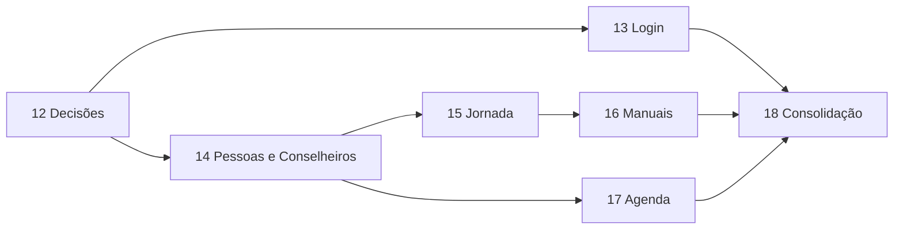

# Roadmap de evolução após avaliação de uso

## Objetivo

Este ciclo responde às observações feitas durante o uso do sistema em 18/09/2026. Ele melhora a coerência visual do login, separa os fluxos de Conselheiros e meninos, simplifica responsáveis, permite correções controladas na Jornada e completa operações administrativas de Manuais e Agenda.

A fonte de verdade continua sendo, nesta ordem, `AGENTS.md`, `DECISIONS.md`, `docs/domain/`, `docs/product/`, `docs/architecture/`, `docs/ux/`, `docs/security/` e `plans/`.

## Princípios preservados

- Igreja permanece como tenant e toda leitura/escrita continua isolada por Igreja.
- Pessoa continua sendo a base compartilhada para evitar duplicação; a separação entre Conselheiro e menino ocorre nos fluxos, consultas e telas.
- Jornada pertence somente a Candidatos e Embaixadores e não deve aparecer como fluxo de Conselheiro ou Visitante.
- Menores continuam sem login e seus dados recebem proteção reforçada.
- Correções cadastrais autorizadas são diretas e não exigem motivo ou histórico funcional detalhado, salvo regra específica documentada.
- Versões de Manual vinculadas a uma Jornada podem receber correções de identificação, texto e ordem. Adicionar ou retirar tarefas altera somente Postos em andamento; Postos concluídos permanecem fatos oficiais.
- Reuniões com frequência e atividades relacionadas não podem perder histórico por exclusão indevida.
- Linguagem de negócio permanece em português brasileiro.
- Web mantém BFF/cookie HttpOnly; mobile mantém Authorization Code + PKCE.
- Todos os fluxos devem incluir autorização, concorrência, estados de interface, acessibilidade e testes de isolamento multi-tenant.

## Sequência obrigatória

Cada etapa deve começar com árvore limpa e ser concluída, validada e registrada em commit próprio antes da próxima.

## Rastreabilidade das observações

| Observação | Decisão | Implementação | Revisão final |
| --- | --- | --- | --- |
| Login diferente do restante do sistema | — | 13 | 18 |
| Atualizar data de conclusão de requisito/tarefa | 12 | 15 | 18 |
| Exibir `Tarefa N: nome` | — | 15 | 18 |
| Diferenciar Conselheiros, Embaixadores, Candidatos, Visitantes e Inativos | 12 | 14 | 18 |
| Não aplicar Jornada e vínculos do menino a Conselheiros | 12 | 14 | 18 |
| Responsáveis com relação, nome, contato e moradia, sem data inicial | 12 | 14 | 18 |
| Simplificar Conselheiro e remover liderança separada | 12 | 14 | 18 |
| Editar Manuais e versões | 12 | 16 | 18 |
| Editar e remover modelos de roteiro | 12 | 17 | 18 |
| Editar entidades promotoras | — | 17 | 18 |
| Editar tipos de atividade | — | 17 | 18 |
| Remover agenda/reunião | 12 | 17 | 18 |

### Etapa 12 — Decisões funcionais

Prompt: `prompts/12-feedback-decisoes.md`

Confirma as decisões necessárias para:

- separação de Conselheiros e meninos;
- novo modelo de responsáveis e migração dos dados atuais;
- significado de Conselheiro e liderança da Embaixada;
- efeito de adicionar/remover tarefas em versões de Manual já utilizadas;
- remoção de modelos, atividades e reuniões com dependências.

Esta etapa altera somente documentação. Nenhuma migration, API ou tela deve ser implementada antes das respostas.

### Etapa 13 — Login alinhado ao design system

Prompt: `prompts/13-login-design-system.md`

Alinha a página Razor de login ao shell autenticado sem alterar autenticação, mensagens neutras, rate limit, antiforgery ou cookies.

### Etapa 14 — Pessoas, Conselheiros e responsáveis

Prompt: `prompts/14-pessoas-conselheiros-responsaveis.md`

Entrega consultas e jornadas visuais distintas para Conselheiros, Embaixadores, Candidatos, Visitantes e Inativos; substitui o vínculo de responsável por campos livres confirmados; e remove o conceito separado de liderança, mantendo cadastro simples de Conselheiros.

### Etapa 15 — Correções da Jornada e numeração de tarefas

Prompt: `prompts/15-jornada-correcoes.md`

Permite corrigir diretamente datas de conclusão, valida a consistência da progressão e exibe o número da tarefa a partir de sua ordem na versão do Manual.

### Etapa 16 — Gestão de Manuais e versões

Prompt: `prompts/16-manuais-gestao.md`

Adiciona edição direta de versões, inclusive das já usadas, sem transformar a correção em migração de Jornada entre edições.

### Etapa 17 — Configurações e remoção na Agenda

Prompt: `prompts/17-agenda-gestao.md`

Completa edição de modelos de roteiro, entidades promotoras e tipos de atividade, além da remoção segura de modelos e itens de agenda/reunião conforme as decisões da Etapa 12.

### Etapa 18 — Consolidação e revisão

Prompt: `prompts/18-feedback-consolidacao.md`

Revê o ciclo inteiro, remove caminhos obsoletos, confirma consistência de contratos, responsividade, acessibilidade, segurança, migrations e regressões de negócio.

## Dependências entre etapas

A ordem numérica continua obrigatória mesmo onde existe independência técnica, pois contratos e documentação são cumulativos.

## Critérios globais de conclusão

- login e aplicação autenticada compartilham linguagem visual, foco, contraste e comportamento responsivo;
- Conselheiros não aparecem misturados ao fluxo operacional de meninos;
- Jornada aparece somente quando aplicável;
- responsáveis usam exatamente os campos confirmados e não exigem cadastro separado de Pessoa;
- correções de datas respeitam idade, sequência, progressão e concorrência, sem exigir histórico funcional detalhado;
- tarefas exibem `Tarefa N: nome` usando a ordem persistida da versão;
- versões usadas podem ser corrigidas diretamente; tarefas adicionadas/retiradas afetam Postos em andamento, sem reabrir ou recalcular Postos concluídos;
- configurações da Agenda podem ser geridas sem quebrar atividades ou reuniões existentes;
- remoções seguem política explícita e preservam frequência, referências financeiras, acervo e os históricos especificamente exigidos;
- toda API nova possui permissão, tenant, validação, OpenAPI e testes;
- web/mobile/.NET passam em build, lint, tipos, formatação e testes;
- E2E e Axe cobrem os fluxos alterados;
- migrations são aplicáveis em banco vazio e banco com dados da versão anterior;
- não há divergência não justificada no contrato OpenAPI;
- auditorias de dependência e `git diff --check` passam;
- validações e riscos são registrados em `docs/quality/`.

## Fora do escopo

- login de meninos ou responsáveis;
- migração de uma Jornada para outra versão de Manual;
- criação de tarefas ou conteúdo do Manual do Emérito;
- relatórios, aniversariantes e Dashboard;
- nova identidade visual oficial;
- reformulação visual ampla do mobile;
- exclusão física de histórico que as decisões confirmadas mandem preservar;
- hierarquia entre Conselheiro-chefe, segundo Conselheiro-chefe e auxiliares;
- controle de frequência de Conselheiros.
